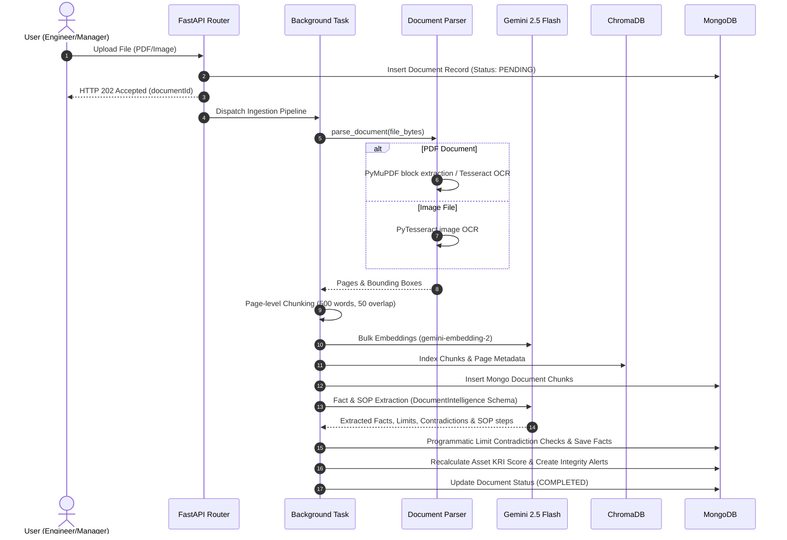

# INDRA — Architecture & System Design Documentation

**Platform Title:** INDRA — Industrial Knowledge Intelligence & Active Reliability Engine  
**Version:** 2.0.0 (Python FastAPI Unified Architecture)

---

## 1. System Overview

INDRA is an AI-powered Industrial Knowledge Intelligence platform designed for asset-intensive industries. It ingests heterogeneous technical documents (OEM manuals, SOPs, inspection records, engineering P&IDs) into a unified knowledge graph and vector store, exposing actionable operational intelligence through multi-role dashboards, RAG decision briefs, and interactive field execution guardrails.

```
                  +-------------------------------------------------------+
                  |                  React 18 + Vite UI                   |
                  |  (Engineer Dashboard | Manager Dashboard | Admin UI)  |
                  +-------------------------------------------------------+
                                              |
                                              | REST API (JWT Bearer Auth)
                                              v
                  +-------------------------------------------------------+
                  |               FastAPI Python Server                   |
                  |                (Uvicorn @ Port 5000)                  |
                  +-------------------------------------------------------+
                     /                      |                      \
                    /                       |                       \
                   v                        v                        v
        +--------------------+    +--------------------+    +--------------------+
        |  PyMongo / MongoDB |    | Persistent Chroma  |    | Google GenAI SDK   |
        |  (Document Store & |    | Vector Database    |    | (Gemini 2.5 Flash  |
        |  Knowledge Facts)  |    | (indra_knowledge)  |    | & Embeddings)      |
        +--------------------+    +--------------------+    +--------------------+
```

---

## 2. Ingestion & RAG Data Flow



---

## 3. Database Schema Mapping (MongoDB)

INDRA uses MongoDB as its primary relational fact and document metadata store:

| Collection | Key Fields | Purpose |
| :--- | :--- | :--- |
| **`users`** | `email`, `password` (hashed), `name`, `role` (`ENGINEER`/`MANAGER`/`ADMIN`), `experienceLevel` | User authentication & role-based authorization. |
| **`assets`** | `code`, `name`, `type`, `description`, `kriScore`, `dciScore` | Plant equipment catalog & reliability metrics. |
| **`documents`** | `title`, `type`, `assets` (code array), `versions`, `processingStatus`, `tags` | Document catalog and versioning records. |
| **`documentchunks`** | `documentId`, `versionNumber`, `pageNumber`, `content`, `boundingBox` | Segmented document chunks for page view rendering. |
| **`facts`** | `type` (`Limit`/`Hazard`/`Warning`/`Part`/`Asset`), `parameter`, `numericValue`, `unit`, `value`, `assetId`, `documentId`, `pageNumber`, `status` (`Extracted`/`Validated`/`Contradictory`) | Granular structured parameters and limits graph. |
| **`procedures`** | `name`, `description`, `assetId`, `steps` (stepNumber, instruction, validationType, measurements, safetyNote) | Standard Operating Procedure (SOP) checklists. |
| **`executionsessions`** | `procedureId`, `assetId`, `engineerId`, `status` (`Active`/`Completed`/`Failed`), `steps`, `warningsRaised` | Live field technician checklist runs and measurement audits. |
| **`decisions`** | `assetId`, `problem`, `brief` (JSON), `engineerId`, `status` (`PENDING`/`APPROVED`/`REJECTED`), `approvedBy` | Logged RAG diagnostic decision briefs and manager approvals. |
| **`integrityalerts`** | `assetId`, `type` (`Contradiction`/`OutdatedManual`/`MissingInspection`), `severity`, `description`, `details`, `status` (`Active`/`Resolved`) | Active reliability warnings flagging risks. |
| **`relations`** | `sourceId`, `targetId`, `type` (`contradicts`), `confidence` | Graph edge mappings between conflicting facts. |

---

## 4. Frontend Component & Routing Architecture

```
src/
├── App.tsx                     # Main Router & Route Guards (ProtectedRoute, PublicRoute)
├── components/
│   ├── Layout.tsx              # Sidebar navigation, header status, role badge
│   └── GlassCard.tsx           # Glassmorphism container wrapper
├── context/
│   └── AuthContext.tsx         # JWT token storage & session state provider
├── pages/
│   ├── Login.tsx               # Auth sign-in screen
│   ├── Register.tsx            # Auth sign-up screen
│   ├── Dashboard.tsx           # Role router (Engineer/Manager/Admin)
│   ├── DocumentsPage.tsx       # Document upload, parsing progress, manual catalog
│   ├── KnowledgePage.tsx       # Graph integrity, DCI/KRI breakdown, facts table
│   ├── DecisionsPage.tsx       # RAG symptom diagnostic engine & brief generator
│   ├── ExecutionPage.tsx       # Interactive SOP checklist execution & bounds checker
│   ├── AssetDetailPage.tsx     # Deep 360-degree asset profile & historical metrics
│   └── dashboards/
│       ├── EngineerDashboard.tsx   # Field engineer workspace & quick actions
│       ├── ManagerDashboard.tsx    # Governance workspace, pending approvals, fleet KRI
│       └── AdminDashboard.tsx      # System health & user management view
└── services/
    ├── api.ts                  # Axios HTTP client with JWT interceptor
    └── auth.ts                 # Auth API wrapper endpoints
```

---

## 5. Security & Authentication Model

* **Token Format**: Standard JSON Web Tokens (JWT) signed with HMAC-SHA256.
* **Header Format**: `Authorization: Bearer <JWT_TOKEN>`.
* **Token Expiration**: Default 24 hours (`JWT_EXPIRES_IN = "24h"`).
* **Role Enforcer**: FastAPI dependency `RequireRole(["MANAGER", "ADMIN"])` guards sensitive operations like decision approvals and user role modifications.
